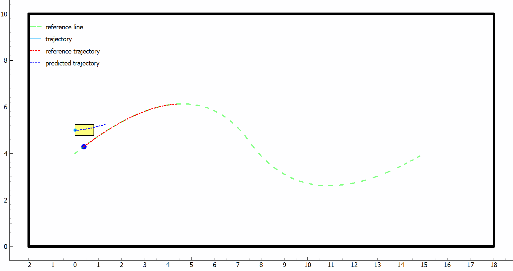

# PlanningCtrlArena

<!-- TOC tocDepth:2..3 chapterDepth:2..6 -->

- [PlanningCtrlArena](#planningctrlarena)
  - [1. Introduction](#1-introduction)
  - [2. Usage](#2-usage)
  - [3. Config](#3-config)
    - [3.1. cars](#31-cars)
    - [3.2. reference\_lines](#32-reference_lines)
    - [3.3. obstacles](#33-obstacles)
  - [4. Algo](#4-algo)
    - [4.1. LQR(Linear Quadratic Regulator)](#41-lqrlinear-quadratic-regulator)
    - [4.2. iLQR](#42-ilqr)
    - [4.3. CiLQR](#43-cilqr)
    - [4.4. MPC(Model Predictive Control)](#44-mpcmodel-predictive-control)
    - [4.5. CMPC(Contingency Model Predictive Control)](#45-cmpccontingency-model-predictive-control)
    - [4.6. level-k](#46-level-k)

<!-- /TOC -->

## 1. Introduction

使用Python实现了一些常见的规划控制算法。

## 2. Usage

- 1. 安装依赖:

    ```bash
    pip install -r requirements.txt
    ```

- 2. 运行示例：从 `src\controller` 目录下找到对应的算法运行即可。运行完成后日志会存放在 `log` 目录下，另外模拟过程的动画会以gif格式存放在 `log` 目录下，模拟过程中车辆的运动数据也会以json格式存放在这个目录下。

## 3. Config

配置文件位于 `config` 目录下，可以通过 `cars` 配置车辆的初始信息， `reference_lines` 配置参考线信息， `obstacles` 配置障碍物信息。

### 3.1. cars

可以通过 `start_pose` 中的 `x` 、 `y` 、 `theta` 配置车辆的初始位置和朝向， `v` 配置车辆的初始速度。示例如下：

```json
{
    "id": "0",
    "start_pose": {
        "x": 0.0,
        "y": 5.0,
        "theta": 0.0
        },
    "v": 0.0
}
```

### 3.2. reference_lines

通过`control_points`配置参考线上的控制点后程序会自动通过三次B样条曲线连接这些控制点，生成参考线。示例如下：

```json
{
    "control_points": [
        {
            "x": 0.0,
            "y": 4.0
        },
        {
            "x": 5.0,
            "y": 8.0
        },
        {
            "x": 10.0,
            "y": 1.0
        },
        {
            "x": 15.0,
            "y": 4.0
        }
    ]
}
```

这样会生成如下图所示的参考线：


### 3.3. obstacles

为了方便后续计算这里的障碍物都是圆形的，可以通过 `center` 中的 `x` 、 `y` 配置障碍物的中心位置， `radius` 配置障碍物的半径。障碍物分为静态障碍物和动态障碍物两种：静态障碍物的特征不会发生变化；对于动态障碍物只有当车辆靠近后才能确切地观测到其是否会出现（通过 `will_appear` 配置）。示例如下：

```json
{
    "obstacles": [
        {
            "type": "static",
            "center": {
                "x": 5.0,
                "y": 6.0
            },
            "radius": 0.2
        },
        {
            "type": "dynamic",
            "center": {
                "x": 10.0,
                "y": 0.0
            },
            "radius": 0.6,
            "will_appear": true
        }
    ]
}
```

在模拟器中，静态障碍物和确认会出现的动态障碍物会以实心圆的形式显示，如下图右边的圆所示，未确认的动态障碍物会以空心圆的形式显示，如下图左边的圆所示。


## 4. Algo

### 4.1. LQR(Linear Quadratic Regulator)

见 `src\controller\LQR.py` ，运行示例如下：


### 4.2. iLQR

见 `src\controller\iLQR.py` ，运行示例如下：



### 4.3. CiLQR

见 `src\controller\CILQR.py` ，运行示例如下：


### 4.4. MPC(Model Predictive Control)

见 `src\controller\MPC.py` ，运行示例如下：


### 4.5. CMPC(Contingency Model Predictive Control)

见 `src\controller\CMPC.py` ，复现了[Contingency Model Predictive Control for Linear Time-Varying Systems](https://arxiv.org/abs/2102.12045)。

在这个算法中为了处理突发情况，除了常规的nominal trajectory外，还会生成一条contingency trajectory：它们共享第一个控制输入，但是nominal trajectory只会考虑已经确认的障碍物，而contingency trajectory会考虑所有可能的障碍物以应对突发情况。它们对优化对象的贡献权重分别由$P^n$和$P^c$控制，$P^n$越大意味这我们更倾向于nominal trajectory，这两个系数分别对应代码中的`NOM_SCALING`和`CONT_SCALING`，可以在配置文件中调整。如下图所示，车辆的前方有一个未确认的动态障碍物，nominal trajectory对应着实线（没有考虑这个障碍物，尽量贴合参考线运动），而contingency trajectory对应的是虚线（考虑了这个障碍物尽量避开它）：


运行实例如下：


我们可以把它与Robust MPC进行对比，Robust MPC会避让所有的动态障碍物，不管它有没有出现。因此可以看到针对最后障碍物没有出现的情况，Robust MPC规划出的路径不如CMPC规划出的路径优：


进一步的，我们对比了$P^n$不同的取值对结果的影响，如下图所示。我们可以看到为了应对右边的障碍物突然出现的情况，在$x = 8.0$附近，$P^n = 0.25$的控制器和$P^n = 0.75$的控制器都采取了调整前轮转角以避让的动作，但是$P^n = 0.25$的控制器的转角极值只有0.42，而$P^n = 0.75$的控制器的转角极值高达0.95，可以看到$P^n = 0.25$的控制器更多地考虑了contingency trajectory因此在面对突发情况的时候控制输出更温和。当然这也是有代价的，作为对比左边的动态障碍物最终没有出现，因此$P^n = 0.25$的控制器在$x = 4.0$附近出现了一次大的转角回调。


为了运行这个例子，需要在把`NOM_SCALING`设置为不同值后跑多次模拟，并把motion_data.json重命名为类似于*Pn_0.25.json*的格式后保存在`data/CMPC`文件夹下，最后运行`tool/CMPC_insight.py`即可。

### 4.6. level-k

见 `src\algo\level_k\level_k.py` ，运行示例如下：


